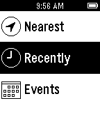
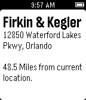

# Pinball Map for Pebble
Pebble app that interacts with the [Pinball Map API](http://pinballmap.com/api/v1/docs). The app is built using Pebble's [Pebble.js](http://developer.getpebble.com/getting-started/pebble-js-tutorial/part1/) app framework.





## Getting Started
You will first need to install the [Pebble SDK](http://developer.getpebble.com/sdk/). Once installed the main source file is in ```/src/js/app.js``` and the app's configuration is in ```appinfo.json```.

To build the project call ```pebble build``` from the project directory.

To install the app on your Pebble first enable Developer Connection by following the guide [here](http://developer.getpebble.com/guides/publishing-tools/developer-connection). Once the developer connection is active call ```pebble install --phone **IP address**```

## Helpful Links
To learn more about Pebble.js follow the quick [getting started guide](http://developer.getpebble.com/getting-started/pebble-js-tutorial/part1/). And for complete Pebble.js documentation visit the [Pebble.js Docs](http://developer.getpebble.com/docs/pebblejs/).